<p align="center">
  
  
  
  
  
</p>

# UzimaMesh

> **AI-driven healthcare coordination platform designed for Kenya's healthcare system.**
>
> Uzima Mesh optimizes patient intake, appointment scheduling, health data analysis, and real-time emergency monitoring — leveraging Azure AI Foundry Agents, MCP, and GitHub Copilot.

---

## 🚀 Live Sandbox

The latest version of Uzima Mesh is deployed and ready for testing.

**URL:** [https://app-uzima-mesh.azurewebsites.net/](https://app-uzima-mesh.azurewebsites.net/)

### Test Credentials

| Role | Email | Password | Status |
|---|---|---|---|
| **Administrator** | `admin@uzimamesh.com` | `uzima123` | Active |
| **Doctor** | `smith@uzima.com` | `password123` | Active |
| **Patient** | `jane@example.com` | `uzima123` | Active |

---

## Overview

Uzima Mesh is a modern, full-stack triage and healthcare coordination platform built with **Django 5.0**. It connects patients to medical professionals through an intelligent, AI-assisted workflow that prioritizes cases by urgency, generates clinical summaries, and empowers doctors with a real-time command center.

### Key Capabilities

- **Real-Time AI Intake Agent** — Patients do not fill out long forms. Instead, they chat directly with an Azure AI Foundry Agent via the `azure-ai-projects` SDK. The conversational AI fluidly gathers demographics, symptoms, and medical history.
- **AI-Powered Triage** — After gathering sufficient information, the Azure Agent assigns an urgency score (1–5), generates a clinical summary, and can use tools to create the triage record directly in the backend.
- **Doctor Command Center** — Authenticated doctors access a real-time dashboard to view, accept, escalate, or request vitals for queued triage sessions, sorted by priority.
- **Model Context Protocol (MCP)** — An MCP server exposes tools like `get_doctor_availability` and `create_triage_record`, enabling AI agents to interact with the Django database programmatically.
- **Microsoft Entra ID SSO** — Enterprise-grade authentication via Azure AD / Microsoft Entra ID using `django-allauth`.
- **Live Updates with HTMX** — Patient queues and doctor dashboards refresh via HTMX partial renders — no full-page reloads needed.

---

## Architecture

### System Overview

Uzima Mesh is built on **Microsoft Azure AI Foundry**, **Microsoft Agent Framework** (`azure-ai-projects` SDK), and **Azure MCP** (Model Context Protocol) — wired together into a single cohesive platform.

```mermaid
flowchart TD
    subgraph Client["🌐 Client (Browser)"]
        UI["Patient Intake Chat\n(HTMX + SSE Streaming)"]
        DC["Doctor Command Center\n(HTMX Dashboard)"]
    end

    subgraph Django["⚙️ Django 5.0 Backend (Azure App Service)"]
        Views["triage/views.py\npatient_intake · api_chat_stream · doctor_dashboard"]
        Services["triage/services.py\nAzureAgentClient · send_message_stream · create_thread"]
    end

    subgraph MCP["🔌 Azure MCP Server (django-mcp / fastmcp)"]
        direction TB
        T1["Tool: create_triage_record"]
        T2["Tool: handoff_to_agent"]
        T3["Tool: consult_agent"]
        T4["Tool: get_doctor_availability"]
    end

    subgraph Foundry["☁️ Azure AI Foundry (azure-ai-projects SDK)"]
        direction TB
        Intake["Intake Agent\nasst_rAQZ3vO6... · GPT-4o"]
        Guardian["Guardian Agent\n24/7 Emergency Sentinel"]
        Analysis["Analysis Agent\nClinical Guidelines · Urgency Scoring"]
        Scheduler["Scheduler Agent\nAppointment Coordination"]
    end

    subgraph DB["🗄️ Database (PostgreSQL / SQLite)"]
        M1["Patient"]
        M2["TriageSession"]
        M3["Doctor"]
        M4["ChatMessage"]
    end

    UI -->|"HTTP POST / SSE"| Views
    DC -->|"HTMX Poll"| Views
    Views --> Services
    Services -->|"azure-ai-projects SDK\ncreate_stream · create_run"| Foundry

    Intake -->|"MCP tool call over SSE"| MCP
    Guardian -->|"MCP tool call over SSE"| MCP
    Analysis -->|"MCP tool call over SSE"| MCP
    Scheduler -->|"MCP tool call over SSE"| MCP

    MCP -->|"Django ORM"| DB

    Intake -->|"handoff_to_agent"| Guardian
    Intake -->|"handoff_to_agent"| Analysis
    Analysis -->|"handoff_to_agent"| Scheduler
```



### Hero Technology Mapping

| Hero Technology | How It's Used | Where |
|---|---|---|
| **Azure AI Foundry** | Hosts the AI Hub + Project; agent definitions authored with Foundry agent schema `1.0.0`; `AIProjectClient` connects via Foundry connection string | `agents/*.agent.yaml`, `triage/services.py`, `infra/ai-foundry.bicep` |
| **Microsoft Agent Framework** | `azure-ai-projects` SDK — creates threads, runs agents, streams responses, submits tool outputs, manages multi-agent handoffs | `triage/services.py` |
| **Azure MCP** | `django-mcp` + `fastmcp` expose an SSE MCP server on the Django app; Foundry agents connect to it via `tools.type: mcp` to call Django ORM tools | `mcp_server/server.py`, `agents/Uzima-Intake-Agent.agent.yaml` |

### Azure Resources

All infrastructure is defined as Bicep IaC in `/infra/` and deployed via Azure Developer CLI (`azd`).

| Azure Resource | SKU / Config | Purpose |
|---|---|---|
| **Azure App Service** (Linux) | S1 · Python 3.11 · 2 instances | Hosts the Django application and MCP SSE endpoint |
| **Azure App Service Plan** | Standard S1 | Compute plan for the App Service |
| **Azure AI Foundry Hub** | `MachineLearningServices/workspaces` · Kind: `Hub` | Top-level AI workspace hub, System Assigned Identity |
| **Azure AI Foundry Project** | `MachineLearningServices/workspaces` · Kind: `Project` | Scoped project linked to the Hub; hosts GPT-4o agents |
| **Azure Database for PostgreSQL Flexible Server** | `Standard_B1ms` · Burstable · PostgreSQL 15 · 32 GB | Production relational database |
| **Azure Resource Group** | `azd`-managed | Logical container for all resources |

### Multi-Agent Handoff Flow

```
Patient Message
      │
      ▼
 Intake Agent  ──── consult_agent ────▶  Analysis Agent
      │                                       │
      │  (urgency confirmed)                  │ (returns score + guideline)
      │                                       │
      └─── handoff_to_agent ────────▶  Scheduler Agent
```

1. **Intake Agent** greets the patient, collects HPI (History of Presenting Illness) one question at a time.
2. If red-flag symptoms are detected, it calls `consult_agent` → **Guardian Agent** for immediate escalation.
3. Once symptoms are gathered, it calls `consult_agent` → **Analysis Agent** to cross-reference Kenya National Clinical Guidelines and get a standardized urgency score.
4. Finally it calls `create_triage_record` (MCP) to persist the session, then `handoff_to_agent` → **Scheduler Agent** to book follow-up.

All agent-to-agent communication happens on a **shared thread** managed by Azure AI Foundry Threads, with tool results submitted back via the Agent Framework.

### Project File Structure

```text
UzimaMesh/
├── uzima_mesh/            # Django project settings & root URL conf
├── triage/                # Core application
│   ├── models.py          # Patient, Doctor, TriageSession, ChatMessage
│   ├── views.py           # Dashboard, intake UI, doctor command center
│   ├── services.py        # Azure AI Projects SDK — AzureAgentClient
│   └── serializers.py     # DRF serializers
│
├── mcp_server/            # Azure MCP Server
│   └── server.py          # FastMCP tools exposed over SSE to Foundry agents
│
├── agents/                # Microsoft Foundry agent definitions
│   └── Uzima-Intake-Agent.agent.yaml
│
├── templates/             # Django templates
│   ├── base.html
│   └── triage/
│       ├── patient_intake.html   # Streaming SSE chat UI
│       ├── doctor_dashboard.html
│       └── dashboard.html
│
├── static/                # Static assets (CSS, JS)
├── infra/                 # Azure Bicep IaC (App Service, PostgreSQL)
├── requirements.txt
├── startup.sh             # Production startup script
└── manage.py
```

---

## Data Models

| Model | Purpose |
|---|---|
| **Patient** | Stores demographics, contact info, medical history, and current prescriptions. |
| **Doctor** | Linked to a user account. Tracks specialty, availability, and bio for doctor matching. |
| **TriageSession** | Core workflow entity. Tracks symptoms, urgency score (1--5), status (Pending / In Progress / Completed / Cancelled), AI summary, and recommended action. |
| **ChatMessage** | Conversational log between the patient and the AI triage agent. |

---

## Getting Started

### Prerequisites

- **Python 3.10+**
- **pip** (or `venv`)
- *Optional:* PostgreSQL (for production; SQLite is used by default for local development)

### 1. Clone the Repository

```bash
git clone https://github.com/ayubsoft254/UzimaMesh.git
cd UzimaMesh
```

### 2. Create a Virtual Environment

```bash
python -m venv .venv
# Windows
.venv\Scripts\activate
# macOS / Linux
source .venv/bin/activate
```

### 3. Install Dependencies

```bash
pip install -r requirements.txt
```

### 4. Configure Environment Variables

```bash
cp .env.example .env
```

Edit `.env` with your values:

| Variable | Description |
|---|---|
| `DJANGO_SECRET_KEY` | Django secret key |
| `DJANGO_DEBUG` | Debug mode (`True`/`False`) |
| `ALLOWED_HOSTS` | Comma-separated allowed hosts |
| `DATABASE_URL` | PostgreSQL connection string |
| `AZURE_CLIENT_ID` | Microsoft Entra ID client ID (Service Principal) |
| `AZURE_CLIENT_SECRET` | Microsoft Entra ID client secret |
| `AZURE_TENANT_ID` | Azure AD tenant ID |
| `AZURE_AI_PROJECT_CONNECTION_STRING` | Azure AI Foundry connection string |
| `AZURE_AI_AGENT_ID` | Azure AI Assistant/Agent ID (`asst_...`) |

### 5. Apply Migrations & Create a Superuser

```bash
python manage.py migrate
python manage.py createsuperuser
```

### 6. Run the Development Server

```bash
python manage.py runserver
```

Visit **http://127.0.0.1:8000/** to access the application. Local server `uvicorn` can also be used if ASGI is preferred for async tools.

---

## Usage

### Patient Intake (`/intake/`)

Patients initiate a real-time chat with the Azure AI Agent. The agent asks questions to determine symptoms and medical history, and uses its MCP tools to formally lodge a `TriageSession` into the database.

### Doctor Command Center (`/doctor/`)

Authenticated doctors see a priority-sorted queue of pending triage sessions. Each card displays the patient name, symptoms, urgency level, and AI-generated summary. Doctors can:
- **Accept** a session to begin treatment
- **Escalate** a critical case
- **Request Vitals** for more diagnostic data

The queue auto-refreshes via HTMX polling.

### Admin Panel (`/admin/`)

Django's built-in admin interface for managing records, users, and roles.

---

## Production Deployment

### Using Gunicorn (Recommended)

The included `entrypoint.sh` automates migrations, static file collection, and Gunicorn startup:

```bash
chmod +x entrypoint.sh
./entrypoint.sh
```

### Static Files

Static files are served in production via **WhiteNoise** with compressed manifest storage.

---

## Tech Stack

| Layer | Technology |
|---|---|
| **Backend** | Django 5.0, Django REST Framework |
| **Frontend** | Django Templates, HTMX, Vanilla CSS |
| **Authentication** | django-allauth, Microsoft Entra ID (Azure AD) |
| **AI / Agents** | Azure AI SDK (`azure-ai-projects`), FastMCP |
| **Database** | SQLite (dev) / PostgreSQL (prod) via `dj-database-url` |
| **Static Files** | WhiteNoise |
| **WSGI Server** | Gunicorn |

---

## License

This project is licensed under the **MIT License**. See the [LICENSE](LICENSE) file for details.

---

<p align="center">
  <sub>Built with care for Kenya's healthcare system</sub>
</p>
